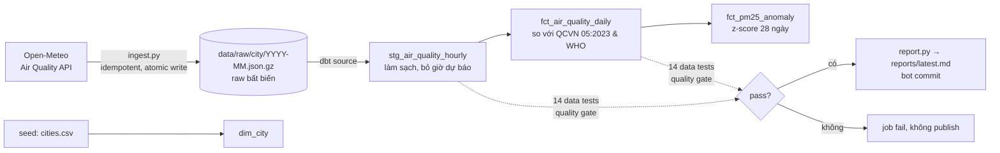
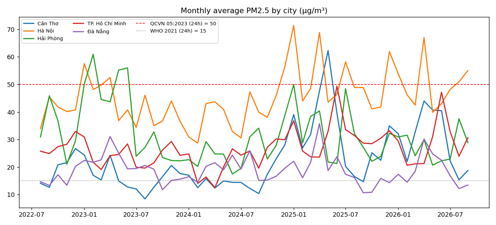
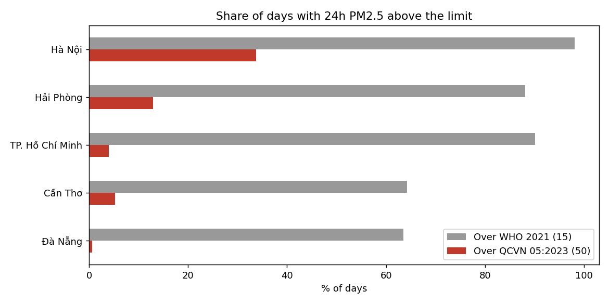

# Vietnam Air Quality Pipeline

[](../../actions/workflows/pipeline.yml)

Pipeline dữ liệu **tự chạy mỗi ngày**: kéo nồng độ PM2.5, PM10, NO₂, O₃, CO, SO₂ theo giờ cho 5 thành phố Việt Nam → lưu raw bất biến → biến đổi bằng **dbt + DuckDB** → chặn dữ liệu hỏng bằng test chất lượng → phát hiện ngày ô nhiễm bất thường → tự commit báo cáo mới.

**Báo cáo mới nhất (bot cập nhật hằng ngày): [`reports/latest.md`](reports/latest.md)**



## Vì sao làm như vậy

| Quyết định | Lý do |
|---|---|
| Raw lưu **nguyên văn** response của API, mỗi thành phố-tháng một file | Sửa logic thì chỉ cần build lại từ raw, không phải gọi lại API. Có lineage `_city`, `_ingested_at` |
| Ghi file tạm rồi `replace` (atomic), chạy lại một tháng là ghi đè | Job **idempotent**: retry hay chạy trùng đều không sinh bản ghi lặp |
| Chạy hằng ngày chỉ kéo tháng hiện tại + tháng trước | Dữ liệu trễ hoặc được sửa lại vẫn được cập nhật; backfill toàn bộ bằng `--backfill` |
| Test lỗi ở mức `error` làm fail job trước bước commit | **Quality gate**: dữ liệu hỏng không bao giờ lên báo cáo |
| DuckDB file, không cần server | Toàn bộ warehouse ~180k dòng, build dưới 2 giây; chạy được cả trên GitHub Actions |

## Test chất lượng đã bắt được lỗi thật

Đây là 3 sự cố gặp phải khi dựng pipeline trên dữ liệu thật, không phải ví dụ minh hoạ:

1. **Hai "thành phố" thực chất là một.** Chuỗi của Hà Nội và Bắc Ninh trùng nhau **36.290/36.290 giờ**. Nguyên nhân: CAMS chạy trên lưới ~0,4° (~45 km) nên hai điểm rơi vào cùng một ô, dù API trả về hai toạ độ khác nhau. Nếu giữ lại, ô lưới này bị đếm hai lần trong mọi số liệu so sánh giữa các thành phố. → Đã bỏ Bắc Ninh và thêm test `assert_cities_are_distinct_grid_cells` để chặn việc thêm thành phố trùng ô về sau.
2. **O₃ = -1,0** ở 17 giờ (13 giờ ở TP.HCM): đây là giá trị sentinel cho "thiếu dữ liệu", không phải nồng độ. → Staging đổi O₃ âm thành `NULL` để không kéo lệch trung bình.
3. **PM2.5 > PM10** trong ~10 giờ ngày 14–15/12/2023 ở Hải Phòng, TP.HCM, Đà Nẵng. Về vật lý điều này không thể xảy ra (PM2.5 là tập con của PM10), nên đây là lỗi mô hình phía nguồn. → Để ở mức `warn`: quá nhỏ để làm lệch trung bình ngày, nhưng vẫn luôn được báo ra chứ không bị giấu.

Các test còn lại: khoá `(city, giờ)` là duy nhất, not-null, quan hệ khoá ngoại tới `dim_city`, giá trị trong ngưỡng vật lý, **độ tươi** (warn nếu dữ liệu cũ hơn 2 ngày), **đủ ngày** (warn nếu thiếu ngày giữa chuỗi).

## Phát hiện (08/2022 – 09/2026, ngày đủ ≥18 giờ dữ liệu)

| Thành phố | PM2.5 TB (µg/m³) | % ngày vượt WHO 2021 (15) | % ngày vượt QCVN 05:2023 (50) |
|---|---:|---:|---:|
| Hà Nội | 45,4 | 98,1% | **33,8%** |
| Hải Phòng | 31,5 | 88,1% | 12,9% |
| TP. Hồ Chí Minh | 26,7 | 90,1% | 4,0% |
| Cần Thơ | 22,7 | 64,3% | 5,3% |
| Đà Nẵng | 18,9 | 63,5% | 0,6% |

- **Chuẩn WHO gần như không đạt được ở đâu cả**: ngay cả Đà Nẵng, nơi sạch nhất, cũng vượt WHO gần 2/3 số ngày. Ngược lại, chuẩn quốc gia QCVN phân tách rõ các thành phố: Hà Nội vượt 1/3 số ngày, Đà Nẵng dưới 1%.
- **Hà Nội ô nhiễm gấp ~2,4 lần Đà Nẵng** tính theo trung bình dài hạn.
- **51 cảnh báo bất thường**. Luật cảnh báo: z-score của log(PM2.5) so với 28 ngày trước **> 2,5**, đồng thời **vượt QCVN**. Điều kiện kép này tránh báo động mỗi ngày ở Hà Nội (lúc nào cũng cao) và tránh báo các đợt tăng đột biến vẫn còn dưới ngưỡng an toàn. Hải Phòng có nhiều cảnh báo nhất (19): nền thấp hơn Hà Nội nên các đợt tăng vọt nổi bật hơn.




## Giới hạn (đọc trước khi trích số)

- **Đây là số liệu mô hình CAMS, không phải số đo trạm.** Độ phân giải ~45 km, nên số liệu là giá trị trung bình cả một vùng chứ không phải một điểm đo. Đỉnh ô nhiễm ở Hà Nội có năm rơi vào tháng 3–4 thay vì mùa đông như số đo trạm thường thấy; nhiều khả năng do mô hình tính cả khói đốt sinh khối trong khu vực (giả thuyết, chưa kiểm chứng). Muốn đổi sang dữ liệu trạm (OpenAQ, cần API key), chỉ cần thay `ingest.py`; các tầng dbt giữ nguyên.
- **Luật cảnh báo dùng trung bình trượt**, không khử mùa vụ. Tháng đầu mùa ô nhiễm có thể bị báo nhiều hơn. Nâng cấp tiếp theo: dùng phần dư STL.
- **Mỗi lần chạy build lại toàn bộ** (~180k dòng, dưới 2 giây). Khi dữ liệu lên hàng chục triệu dòng thì chuyển `fct_*` sang incremental model.

## Chạy

```bash
pip install -r requirements.txt
python ingest.py --backfill                                   # lần đầu: toàn bộ lịch sử từ 2022-08
python ingest.py                                              # hằng ngày: tháng này + tháng trước
dbt build --project-dir warehouse --profiles-dir warehouse    # models + 14 tests
python report.py                                              # reports/
pytest -q
```

Mọi lệnh chạy từ thư mục gốc repo. GitHub Actions ([`pipeline.yml`](.github/workflows/pipeline.yml)) chạy lúc 08:30 giờ Việt Nam mỗi ngày: test → ingest → dbt build (quality gate) → report → commit.

**Stack:** Python (chỉ dùng stdlib cho phần ingest) · dbt-core 1.12 · DuckDB · GitHub Actions · pandas/matplotlib.
